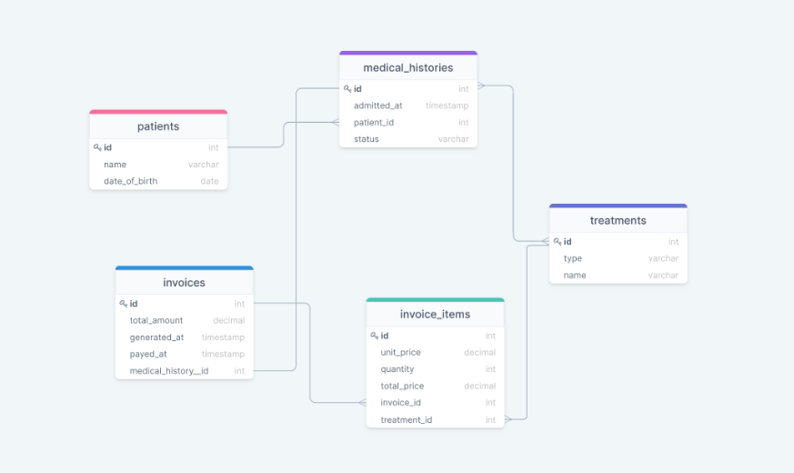

# HospitalDB

## Creating DataBase from Diagram
In this project we created database from given diagram.
Created tables and relationships between them.

# screenshots

## Technologies
Project is created with:
* PostgreSQL

## Setup
To run this project, install it locally using:
- cd Desktop
- git clone https://github.com/mugishasam123/hospital-db.git
- cd hospital-db

## Getting Started
This repository includes files with plain SQL that can be used to recreate a database:
- Use [schema_based_on_diagram.sql](./schema_based_on_diagram.sql) to create all tables.

## Authors

👤 ** Mugisha Samuel**

- GitHub: [mugishasamuel](https://github.com/mugishasam123)
- LinkedIn: [mugishasamuel](https://www.linkedin.com/in/mugisha-samuel-55a905208/)

👤 **Dejan Vujovic**

- Github : [@VuDej](https://github.com/VuDej)
- Twitter: [@DejanVuj](https://twitter.com/DejanVuj)
- LinkedIn : [@Dejan-Vujovic](https://www.linkedin.com/in/dejan-vujovic-5a0672225/)
  
## 🤝 Contributing

Contributions, issues, and feature requests are welcome!

Feel free to check the [issues page](https://github.com/mugishasam123/hospital-db/issues/1).

## Show your support

Give a ⭐️ if you like this project!

## Acknowledgments

- Hat tip to anyone whose code was used
- Inspiration
- etc

## 📝 License

This project is [MIT](https://opensource.org/licenses/MIT)) licensed.
